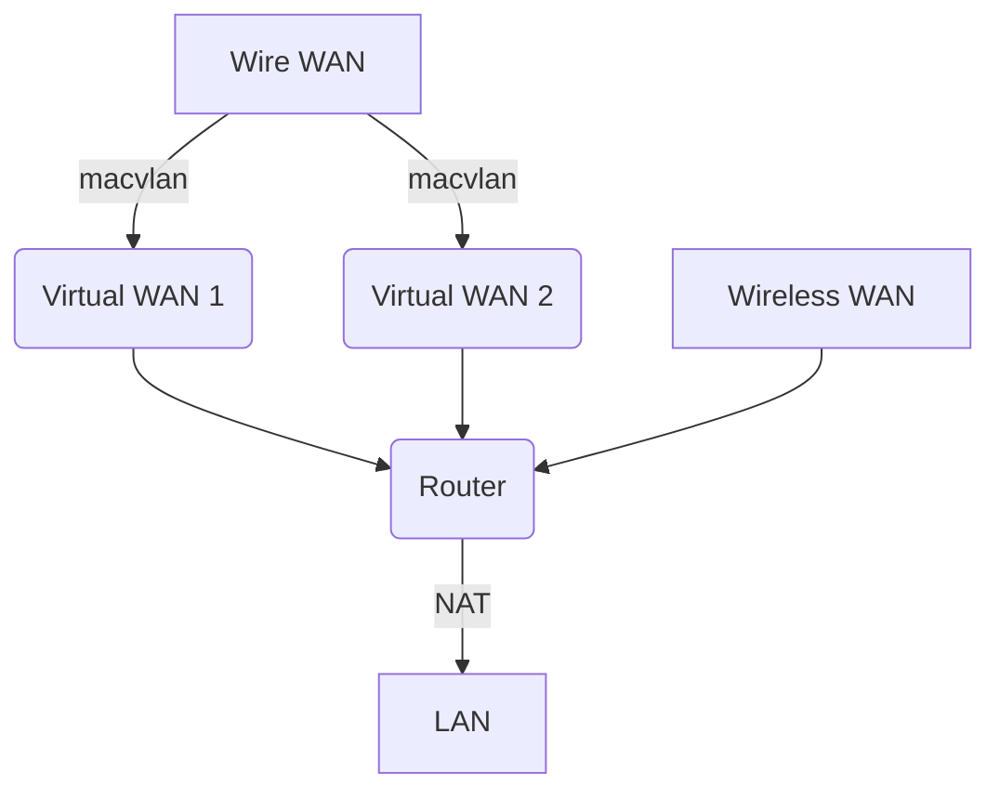

书接[上文](https://sxlllslgh.github.io/2022/09/26/openwrt-ipv6-nat)，本文介绍一下新版OpenWRT上的单线多拨。其中，“单线（多个虚拟网卡）”用macvlan实现，“多拨”则用mwan3实现。此外因为我的网络的特殊情况（有线网稳定但很慢，无线网比较快但容易掉线），因此我还附加了将无线网转到有线网的操作，即WLAN的客户端模式。整个网络的拓扑图大致如下：



# 单线多拨

## 安装

包的安装没什么好说的：

```shell
opkg update
opkg install macvlan mwan3
```

> 截至我写这篇文章时，mwan3仍旧没有对新版防火墙做支持，因此他会默认安装旧版的iptables，因此[上文](https://sxlllslgh.github.io/2022/09/26/openwrt-ipv6-nat)绕开旧版防火墙的折腾目前是没有意义的，但将来总会适配的。

## 配置

# 虚拟网卡和网络接口

这里先做个双拨，再网上叠加都照猫画虎就行。首先修改`/etc/config/network`，添加以下内容，用于添加虚拟网卡：

```conf
config device
	option type 'macvlan'
	option ifname 'eth1'
	option mode 'vepa'
	option name 'vth0'
	option macaddr '自定义的MAC地址1'

config device
	option type 'macvlan'
	option ifname 'eth1'
	option mode 'vepa'
	option name 'vth1'
	option macaddr '自定义的MAC地址2'
```

注意自定义的MAC地址不能和物理网卡一样，否则会出问题。

然后再添加网络接口，每个接口和虚拟网卡一一对应，仍然是修改`/etc/config/network`：

```conf
config interface 'wan'
	option device 'vth0'
	option proto 'pppoe'
	option username '拨号用户名'
	option password '拨号密码'
	option ipv6 'auto'
	option metric '1'

config interface 'wan6'
	option device 'vth0'
	option proto 'dhcpv6'
	option metric '1'

config interface 'wanb'
	option device 'vth1'
	option proto 'pppoe'
	option username '拨号用户名'
	option password '拨号密码'
	option ipv6 'auto'
	option metric '2'

config interface 'wanb6'
	option device 'vth1'
	option proto 'dhcpv6'
	option metric '2'
```

几个注意事项：

1. 后面跟个6的表示是IPv6接口。
2. 对于每组接口（IPv4一个和IPv6一个），都应该对应不同的虚拟网卡。
3. 每个协议下的接口都应具有不同的距离度量（metric）。即比如这里的IPv4接口wan和wanb，两个metric就必须不一样。但组内不同协议的接口则没必要一样，比如wan和wan6，两个metric我图方便都写了1，其实可以不一样。
4. 即便拨号后，每个wan接口会衍生出自己的IPv6虚拟接口，也不要删除这里定义的接口。

## mwan3多拨

这里修改完后，再去修改mwan3的设置`/etc/config/mwan3`，这里只列出一组接口的配置：

```conf
# 这里的IPv4接口名称对应之前/etc/config/network里的接口名称
config interface 'wan'
	option enabled '1'
	option family 'ipv4'
	option initial_state 'online'
	list track_ip 'www.baidu.com'
	option track_method 'ping'
	option count '1'
	option size '56'
	option max_ttl '60'
	option timeout '4'
	option interval '10'
	option failure_interval '5'
	option recovery_interval '5'
	option down '5'
	option reliability '1'
	option up '1'

# 这里的IPv6接口对应拨号后DHCPv6获取的虚拟接口名称，一般就是IPv4接口名称后面加个底杠“_”再跟个“6”
config interface 'wan_6'
	option family 'ipv6'
	option enabled '1'
	option initial_state 'online'
	option track_method 'ping'
	option count '1'
	option size '56'
	option max_ttl '60'
	option timeout '4'
	option interval '10'
	option failure_interval '5'
	option recovery_interval '5'
	option down '5'
	option reliability '1'
	option up '1'
    # 这里的追踪地址建议写一个IPv6网站的IP地址，用域名的话有时候解析会有问题导致本来网通着但检测失败下线了
	list track_ip 'xxxx:xxxx:xxxx:xxxx:xxxx:xxxx:xxxx:xxxx'
```

其他接口配置照着写就可以，这里仍然以两组接口为例（wan/wan_6和wanb/wanb_6），则需要依次配置每个接口的权重和距离、默认路由规则和负载均衡策略，修改`/etc/config/mwan3`：

```conf
# 先配置每个接口的权重和距离
config member 'wan_m1_w1'
	option interface 'wan'
    # 默认距离度量为1，如需修改可以在这里改，仍然是IPv4和IPv6各自考虑
	option metric '2'
    # 默认权重为1，如需修改可以在这里改
    option weight '2'

config member 'wan6_m1_w1'
	option interface 'wan_6'

config member 'wanb_m1_w1'
	option interface 'wanb'

config member 'wanb6_m1_w1'
	option interface 'wanb_6'

# 默认路由规则
config rule 'default_rule_v4'
	option dest_ip '0.0.0.0/0'
	option family 'ipv4'
	option use_policy 'balanced'

config rule 'default_rule_v6'
	option dest_ip '::/0'
	option family 'ipv6'
	option use_policy 'balanced'

# 负载均衡策略
config policy 'balanced'
	list use_member 'wan_m1_w1'
	list use_member 'wanb_m1_w1'
	list use_member 'wan6_m1_w1'
	list use_member 'wanb6_m1_w1'
	option last_resort 'default'
```

其余配置一般保持默认即可。

## mwan3特殊配置

mwan3有个常用的附加配置，就是固定流量的接口。比如HTTPS协议的流量，必须哪儿出哪儿进，因此固定HTTPS协议的443端口TCP流量：

```conf
config rule 'https'
	option sticky '1'
	option dest_port '443'
	option proto 'tcp'
	option use_policy 'balanced'
```

# 无线网转有线网

接下来就是将无线网转到有线网，即开启无线网的客户端模式，修改`/etc/config/wireless`：

```conf
config wifi-iface 'default_radio1'
	option device 'radio1'
	option encryption 'none'
	option mode 'sta'
	option ssid '你要连接的WLAN名称'
	option bssid '你要连接的WLAN热点MAC地址'
	option ifname 'wwan'
	option network 'wwan'
	option macaddr '可以虚拟一个MAC地址用于某些需要绑定或认证的场景'
```

上述配置新加了一个名为`wwan`的网络，需要修改`/etc/config/firewall`将其加入WAN防火墙组：

```conf
config zone
	option name 'wan'
	list network 'wan'
	list network 'wan6'
	list network 'wan_6'
	list network 'wanb'
	list network 'wanb6'
	list network 'wanb_6'
	list network 'wwan'
	option input 'REJECT'
	option output 'ACCEPT'
	option forward 'REJECT'
	option masq '1'
	option mtu_fix '1'
```

如此一来，就可以连接上WLAN了。接下来修改`/etc/config/mwan3`将其加入多拨：

```conf
config interface 'wwan'
	option enabled '1'
	option family 'ipv4'
    # 照抄有线网的IPv4配置即可

config member 'wwan_m1_w1'
	option interface 'wwan'

# 在负载均衡策略里添加wwan网络
config policy 'balanced'
	list use_member 'wwan_m1_w1'
	list use_member 'wan_m1_w1'
	list use_member 'wanb_m1_w1'
	list use_member 'wan6_m1_w1'
	list use_member 'wanb6_m1_w1'
	option last_resort 'default'
```

## 固定流量网络接口

开头说过，我的网络下，有线网稳定但慢，无线网快但不稳，因此，对于需要稳定连接但速度要求不高的流量，比如SSH，我想把他固定在有线网上，于是继续修改`/etc/config/mwan3`，添加一组仅走有线网的策略，并将SSH流量绑定到这个策略上：

```conf
config policy 'wire_only'
	list use_member 'wan_m1_w1'
	list use_member 'wan6_m1_w1'
	list use_member 'wanb_m1_w1'
	list use_member 'wanb6_m1_w1'
	option last_resort 'unreachable'

config rule 'SSH'
	option proto 'tcp'
	option dest_port '22'
	option sticky '1'
	option use_policy 'wire_only'
```

# 总结

至此，一个实现了单线多拨+整合无线网的负载均衡就实现了。我这里测速没有提升（即便是开多线程，不确定是不是HTTPS固定的问题），但迅雷是实打实所有接口都跑满了，肥肠奈斯。